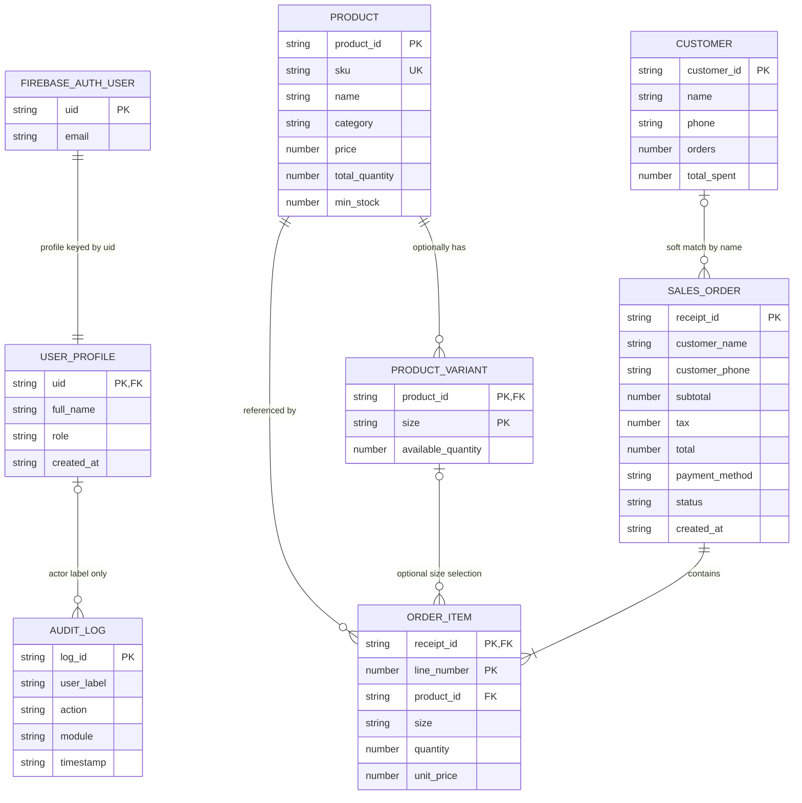
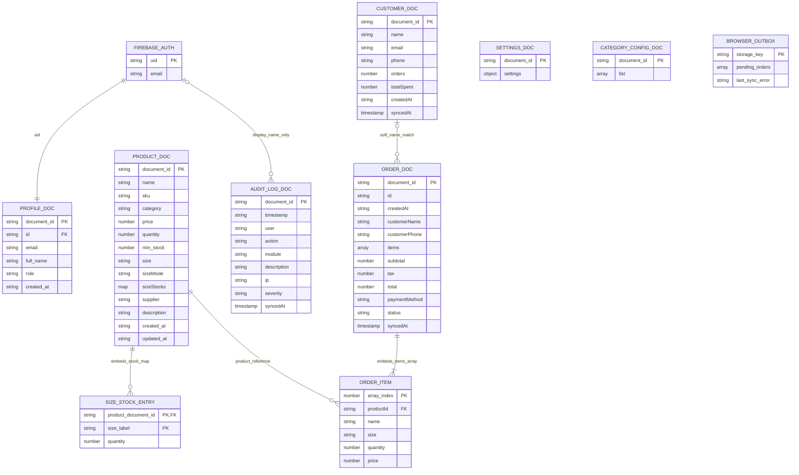

# POS Data Model ERD

This document shows the logical relationships and the physical Firebase/Firestore layout used by the application.

## Logical ERD

`PRODUCT_VARIANT` is a logical entity. In Firestore, variants are embedded in an optional `sizeStocks` map on the product document. `ORDER_ITEM` records are embedded in the order document; `line_number` is a conceptual key, not a stored field.

The customer-to-order and profile-to-audit relationships are soft associations, not enforced foreign keys. Orders store `customerName` and audit logs store a user label; neither currently stores a stable customer/profile document ID.

## Physical Firestore Model

The boxes above follow SQL-modeler ER notation for readability; this is still a Firestore document model, not a relational schema. `ORDER_ITEM` rows are elements of `ORDER_DOC.items`, `SIZE_STOCK_ENTRY` values live inside `PRODUCT_DOC.sizeStocks`, and `BROWSER_OUTBOX` represents localStorage keys rather than a Firestore collection. `document_id` and `array_index` are diagram keys, not fields persisted in those shapes. Firestore does not enforce the diagram's FK labels.

### Collection Details

| Path | Document ID | Notes |
| --- | --- | --- |
| `profiles/{uid}` | Firebase Auth UID | The profile is keyed by the corresponding auth account. |
| `inventory/{productId}` | Firestore-generated ID | `quantity` is the total stock. When `sizeStocks` exists, it maps each size label to its available integer quantity and `quantity` is kept as the sum. Legacy products without the map use shared stock. |
| `orders/{receiptId}` | Receipt ID | Order items are embedded. Each item stores a product document ID, a size label (possibly empty), quantity, and unit price. |
| `customers/{autoId}` | Firestore-generated ID | Customer statistics are stored on the customer document; orders associate by name only. |
| `audit_logs/{autoId}` | Firestore-generated ID | The `user` field is a display label, not a profile foreign key. |
| `config/settings` | Fixed ID `settings` | Store settings singleton. |
| `config/categories` | Fixed ID `categories` | Custom categories are stored in a `list` array. |

A sale transaction reads its receipt and affected inventory documents, validates current stock, then atomically updates inventory and creates the order. If the transaction cannot commit, the order is retained in the browser outbox and retried later with the same receipt ID. The outbox is local to that browser until committed and is not a Firestore collection.
